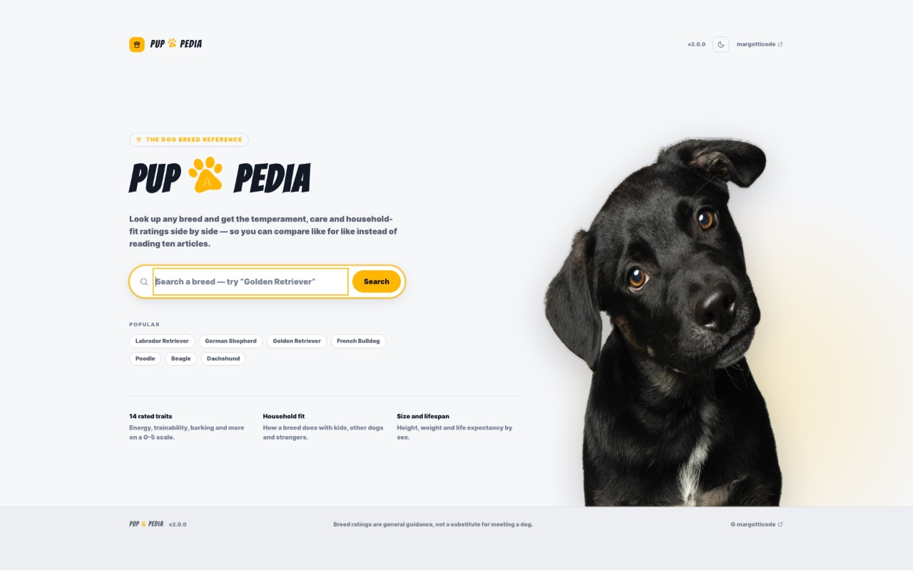

# Pup-A-Pedia

Look up a dog breed and get its temperament, care needs, household fit, size and
lifespan laid out side by side, so you can compare breeds like for like instead
of reading ten articles that all say something different.

Pup-A-Pedia started as a React Native app published on the Apple App Store. This
repo now holds both that original mobile app and a web version, redesigned for
the browser so anyone can use it from a link instead of installing anything.

**Live site:** https://puppedia.margotticode.com



## What's in this repo

| Path | What it is |
| --- | --- |
| `/` | The original React Native / Expo app, published to the Apple App Store |
| `Desktop-Version/` | The web version: React + Vite, built for the desktop canvas and responsive down to phones |

The two share no code. See [`Desktop-Version/README.md`](Desktop-Version/README.md)
for what the web app does and how to run it, and
[`Desktop-Version/CLAUDE.md`](Desktop-Version/CLAUDE.md) for its architecture and
conventions.

## Highlights of the web version

- Search any breed and read 14 traits scored 0 to 5, from energy and
  trainability to how it does with kids, other dogs and strangers.
- Filter a long result list by requirements like great with kids or low
  shedding, with each option showing how many breeds it would leave you.
- Add up to four breeds to a compare tray that survives searches and reloads,
  then view them side by side with an "only show differences" toggle.
- Light and dark themes, and a layout that works from a wide monitor down to a
  phone.

## Running the web version

```bash
cd Desktop-Version
npm install
npm run dev
```

Breed data comes from a hosted API; copy `Desktop-Version/.env.example` to
`.env` and fill in `VITE_API_URL` and `VITE_API_KEY`.

## Portfolio card

The block below is machine-readable project info for a portfolio site (invisible on GitHub). Keep it in sync when the project, URL or tech changes. To build a card: read this JSON and use `title`, `tagline`/`description`, `thumbnail`, `tech`, and link to `liveUrl` and `repoUrl`.

<!-- portfolio-card:start
{
  "title": "Pup-A-Pedia",
  "category": "web app",
  "tagline": "A dog breed reference that puts temperament, care and household fit side by side.",
  "description": "Search any dog breed and get 14 traits scored 0 to 5 alongside height, weight and lifespan, so breeds can be compared like for like. A refine panel narrows long result lists by requirements such as good with kids or low shedding, and a compare tray holds up to four breeds across separate searches to show them side by side, with an option to hide every row where the breeds agree. Originally built as a React Native app published on the Apple App Store, then redesigned as a responsive web version so it can be used from a link with no install.",
  "liveUrl": "https://puppedia.margotticode.com",
  "repoUrl": "https://github.com/jgotti1/pup-a-pedia-React-Native",
  "thumbnail": "https://raw.githubusercontent.com/jgotti1/pup-a-pedia-React-Native/main/docs/preview.jpg",
  "tech": ["React", "Vite", "JavaScript", "CSS", "React Native", "Expo"],
  "features": [
    "14 breed traits scored 0 to 5 with plain-English meanings",
    "Compare up to 4 breeds side by side, with an only-show-differences view",
    "Compare tray persists across separate searches and reloads",
    "Filters that only appear when they can actually narrow the results",
    "Light and dark themes, desktop through mobile",
    "Keyboard navigable with focus-trapped dialogs and screen reader support"
  ],
  "platforms": ["desktop", "tablet", "mobile"],
  "status": "live",
  "origin": "Published on the Apple App Store as a React Native app, then redesigned as a mobile friendly web version for easier access."
}
portfolio-card:end -->
